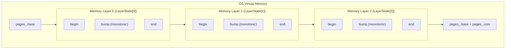
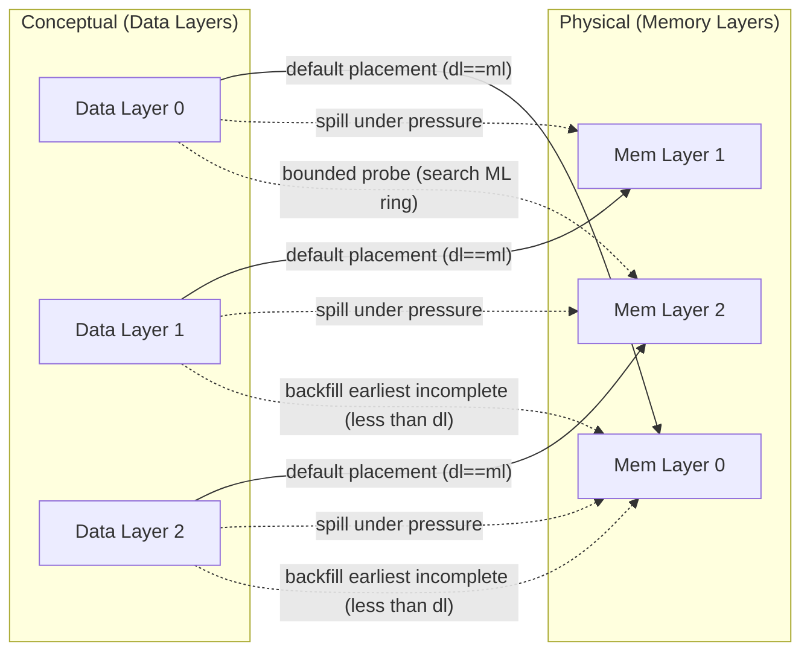
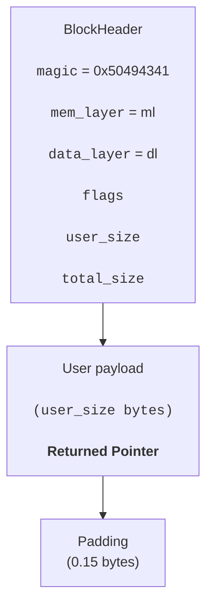
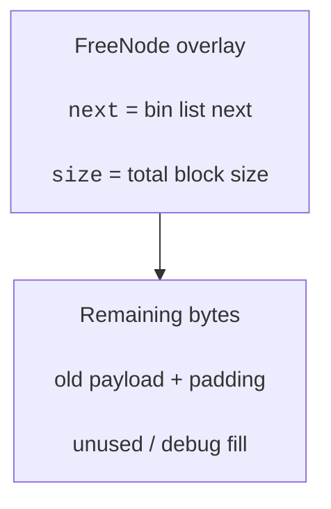
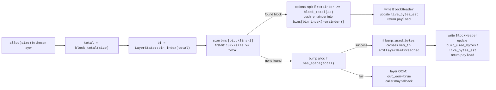
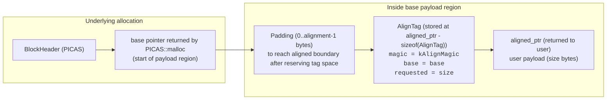
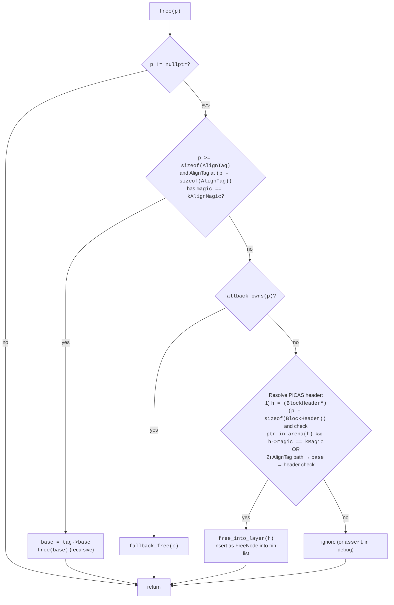
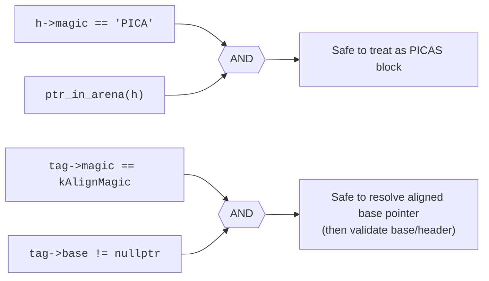

# **Policy Indexed Contiguous Allocation System (PICAS) – Context Aware and Policy Driven Memory Allocator for Highly Deterministic Real Time Systems via C++**

<div align="center">


</div>

## 💬 **1. Abstract**
**PICAS (Policy Indexed Contiguous Allocation System)** is a layered memory allocation framework designed to bridge the gap between traditional low-level allocators (such as `malloc`, `jemalloc`, and `tcmalloc`) and modern, context-sensitive memory management requirements found in real-time systems, adaptive runtimes, and data-intensive workloads. Conventional allocators predominantly rely on *local heuristics*—such as size classes, freelists, and arena partitioning—or *global statistical tuning* that reacts indirectly to workload behavior. While highly optimized for general-purpose use, these approaches lack an explicit representation of **execution phase**, **semantic intent**, or **future allocation trajectory**. As a result, they are often blind to higher-level structure in allocation patterns, leading to suboptimal memory placement, premature fragmentation, or uncontrolled cross-arena spillover. PICAS addresses this limitation by introducing a **policy-driven** yet **phase and context aware allocation model** in which allocation decisions are explicitly informed by *semantic execution context*. Memory is modeled not as a flat pool, but as a sequence of **logical layers**, each associated with both **data progression** and **memory capacity progression**. This allows allocation behavior to adapt dynamically as workloads evolve, rather than reacting only after memory pressure has already manifested.

At its core, PICAS implements a **dual-layer abstraction**:

- **Data Layers** represent the *conceptual phase* or progression stage of allocation requests (e.g., initialization, steady-state, streaming, finalization, or algorithmic epochs).
- **Memory Layers** represent *physically partitioned memory regions*, each with independent capacity limits, transitory checkpoints, and lifecycle constraints.

Allocation decisions are governed by a **policy engine** that continuously evaluates real-time signals, including:
- allocation counts and allocated bytes per data layer,
- memory layer transitory points (MEM-TP) and logical full conditions (MEM-LP),
- cross-layer stranding risk and fragmentation potential,
- bounded spill, probe, and backfill opportunities.

This design enables behaviors that are **non-expressible in traditional allocators**, such as:
- advancing data phases even when memory layers lag behind,
- safely backfilling into earlier memory layers to reduce stranded capacity,
- bounded cross-layer allocation with explicit penalty modeling,
- allocator-level reasoning about *future memory pressure*, not just current availability.

Importantly, PICAS is **not a simulation or purely academic construct**. It is implemented as a fully functional, production-grade C++ allocator featuring:
- OS-backed virtual memory reservation and commitment,
- thread-safe bump-pointer and free-list hybrid allocation,
- full support for `malloc`, `free`, `realloc`, `calloc`, and `memalign`,
- robust safety fallbacks to system allocators,
- scavenging and anti-stranding mechanisms,
- detailed event hooks and trace-level observability.

The design philosophy of PICAS aligns with modern systems research that treats memory allocation as a **first-class adaptive subsystem**, rather than a static utility. In this sense, PICAS serves both as:
- a **practical allocator** usable in real applications and experimental runtimes, and
- a **research platform** for exploring policy-driven, phase-aware memory management strategies.

PICAS is particularly well-suited for:
- real-time and low-latency systems,
- long-running services with well-defined workload phases,
- AI / ML pipelines with structured memory lifecycles,
- experimental runtimes, compilers, and allocator-aware systems.

PICAS follows the same design principles as the **SyntraLine++ Compiler**: explicit structure, formal reasoning, observability, and extensibility—aiming where in this case is not merely to *allocate memory*, but simultaneously to **model, control, and reason about memory behavior over time**.

## 💡 **2. Motivation**
Modern software systems increasingly exhibit **structured allocation behavior** that traditional memory allocators were never designed to understand or exploit.

Examples include:
- applications with clear **initialization → steady-state → teardown** phases,
- AI / ML pipelines with **epoch-based or batch-oriented memory lifecycles**,
- long-running services where memory pressure evolves **predictably but non-uniformly** over time,
- real-time or latency-sensitive systems that must avoid allocator-induced stalls or fragmentation spikes.

Conventional allocators such as `malloc`, `jemalloc`, and `tcmalloc` are fundamentally **phase-agnostic**. They treat allocation requests as independent events and rely on:
- size-class heuristics,
- statistical feedback loops,
- background scavenging or decay mechanisms.

While extremely optimized, these designs lack a mechanism to express **semantic intent**, **execution context**, or **expected future allocation behavior**. As a result:

- memory placement decisions are made *locally*, not globally,
- allocators react to fragmentation *after it occurs*,
- cross-arena or cross-region spills are implicit and opaque,
- developers have no structured way to guide allocation strategy without manual pooling or ad-hoc allocators.

Research allocators and custom memory pools address parts of this problem, but typically at the cost of:
- rigid allocation models,
- poor generality,
- limited safety or fallback behavior,
- lack of observability and formal reasoning.

**PICAS is motivated by the idea that memory allocation should be:**
1. **Context-aware**, not purely size-driven  
2. **Policy-driven**, not hard-coded  
3. **Phase-aware**, not temporally blind  
4. **Observable**, not opaque  
5. **Safe**, even under pathological workloads  

Rather than replacing existing allocators with yet another heuristic, PICAS reframes memory allocation as a **controlled progression problem**, where both *data* and *memory* advance through structured layers under explicit rules.

## 📚 **3. Introduction and Core Concepts**
**PICAS (Policy-Informed Context-Aware Allocator)** is a layered memory allocator that models allocation behavior as the interaction between **data progression** and **memory capacity progression**, mediated by a configurable policy engine. At a high level, PICAS introduces **three foundational ideas** and implementation rigors.

---

### 🎚️ **3.1. Dual-Layer Model (Data vs Memory)**
PICAS separates the notion of *what is being allocated* from *where it is allocated*.
- **Data Layers**  
  Represent the *conceptual stage* of allocation:
  - initialization phase,
  - steady-state processing,
  - streaming segments,
  - algorithmic epochs,
  - teardown or finalization.

Data layers advance based on **allocation counts, bytes, or explicit control**, not on memory exhaustion alone.
- **Memory Layers**  
  Represent *physically partitioned memory regions* with:
  - fixed capacity,
  - monotonic bump allocation,
  - transitory checkpoints (MEM-TP),
  - logical full conditions (MEM-LP),
  - independent fragmentation and reuse behavior.

These two layer spaces are **not required to advance synchronously**. This decoupling is the core conceptual difference between PICAS and traditional allocators.

---

### ⚖️ **3.2. Policy-Driven Allocation Decisions**
Allocation behavior in PICAS is governed by a **policy engine**, not hard-coded heuristics.

For each allocation request, the policy observes:
- current data layer,
- current memory layer,
- allocation count and bytes in the current data phase,
- memory usage and remaining capacity,
- whether previous memory layers are incomplete,
- safety constraints (e.g., stranding limits).

Based on this state, the policy may decide to:
- allocate in the same layer,
- advance the data layer,
- advance the memory layer,
- backfill into an earlier memory layer,
- spill to another layer within bounded limits,
- trigger fallback allocation if safety requires it.

This makes PICAS **explicitly programmable at the allocator level**, enabling controlled experimentation and workload-specific tuning without rewriting allocation logic.

---

### 🕹️ **3.3. Transitory Points and Controlled Progression**
PICAS introduces **explicit checkpoints** that model meaningful transitions:

- **Data Transitory Points (TLP / DATA-LP)**  
  Indicate when a data layer has reached a logical boundary (e.g., “phase complete”).

- **Memory Transitory Points (MEM-TP)**  
  Indicate when a memory layer has consumed a configured portion of its capacity.

These points act as **signals**, not hard stops. The policy decides how to react:
- jump forward,
- delay progression,
- backfill earlier layers,
- or continue allocation cautiously.

This enables **graceful, controlled progression** rather than abrupt exhaustion-driven behavior.

---

### 🦺 **3.4. Safety, Fallback, and Practicality**
Despite its expressive power, PICAS is designed to be **practically usable**:
- thread-safe allocation paths,
- real OS-backed virtual memory,
- `malloc` / `free` / `realloc` / `calloc` / `memalign` compatibility,
- bounded probing to avoid unbounded search,
- anti-stranding mechanisms to prevent pathological fragmentation,
- safe fallback to system allocators under pressure.

In other words, PICAS is not a replacement for safety — it is a **superset** that degrades gracefully.

---

### 🔬 **3.5. Observability as a First-Class Feature**
Every meaningful allocator decision in PICAS can emit:
- structured events,
- trace entries,
- layer transitions,
- spill and backfill actions.

This allows developers and researchers to **observe allocator behavior directly**, rather than infer it from performance anomalies.

---

In summary, **PICAS reframes memory allocation as a controlled, layered progression problem**, where policy, context, and safety coexist. It does not attempt to out-optimize mature allocators on microbenchmarks; instead, it provides a **new abstraction layer** for reasoning about memory behavior over time — something existing allocators fundamentally lack.

## 🎄 **4. Project Structure**
PICAS is built under several primary implementation such as core allocator, policy interface, safety and scavenger subsystems, tests, benchmarks, examples, and build scripts, likewise shown in the project directory below:
```graphql
picas/
├── CMakeLists.txt
├── LICENSE
├── README.md
├── .gitignore
│
├── include/
│   └── picas/
│       ├── picas.hpp          # Public API: PICAS class + global C-style functions
│       ├── config.hpp         # Config structs: layer sizes, points, safety knobs, scavenger settings
│       ├── events.hpp         # Event types + Event struct + hook types
│       ├── halting.hpp        # Debug halting controller (pause on events)
│       ├── os_pages.hpp       # OS VM API: reserve/commit/release + page size
│       ├── layer.hpp          # BlockHeader, FreeNode, LayerState (bins + bump + accounting)
│       ├── policy.hpp         # PolicyInput/PolicyOutput + Policy interface
│       ├── tracer.hpp         # Tracing data structures + recorder interface
│       └── fallback.hpp       # Fallback allocator interface (system allocator safety net)
│
├── src/
│   ├── picas.cpp              # Allocator core: malloc/free/realloc/memalign + global singleton API
│   ├── policy.cpp             # Policy implementation: DL/ML decisions, jump/backfill/spill logic
│   ├── safety.cpp             # Config validation/sanitization + safety defaults
│   ├── scavenger.cpp          # Maintenance: coalescing/cleanup of freed blocks (light run)
│   ├── tracer.cpp             # Trace buffering / serialization utilities (e.g., dump)
│   ├── fallback.cpp           # Fallback backend: alloc/free/usable_size/owns
│   └── os_pages.cpp           # Platform VM calls: mmap/VirtualAlloc wrappers, commit logic
│
├── examples/
│   ├── demo_realistic.cpp      # End-to-end “realistic workload” demo (phases, events, stats)
│   └── demo_trace_dump.cpp     # Demonstrates tracing + dumping recorded trace entries
│
├── benchmarks/
│   └── bench_mix.cpp           # Mixed allocation benchmark (size variety + churn)
│
├── tests/
│   ├── smoke.cpp               # Minimal “does it run / basic API sanity” test
│   ├── test_correctness.cpp    # Heavier correctness tests (realloc, memalign, stress, 
│   └── ...                     # More sets of tests
invariants)
│
└── scripts/
    ├── 00_configure.sh         # Configure Release build (build/)
    ├── 01_build.sh             # Build Release targets
    ├── 02_test.sh              # Run Release tests via ctest
    ├── 03_configure_asan.sh    # Configure ASAN/UBSAN build (build_asan/)
    ├── 04_build_asan.sh        # Build ASAN targets
    ├── 05_test_asan_mac.sh     # Run ASAN tests on macOS (LSan disabled)
    ├── 05_test_asan.sh         # Run ASAN tests on Linux (LSan enabled by default)
    ├── 10_run_demo_realistic.sh
    └── 11_run_demo_trace_dump.sh
```

---

### 🪵 **4.1. Root Files (Documentation and Specifications)**
- **C++ Specifications (`CMakeLists.txt`)** <br>
    - Build entrypoint
    - PICAS static library
    - Optional examples / benchmarks / tests
    - Sanitizer interface target (ASAN/UBSAN) + helper (picas_apply_sanitize())

- **Documentation (`README.md`)**
    - Documentation: concept, architecture, formalization, build & test, usage, roadmap.

- **Licensing (`LICENSE`)**
    - License for reuse and distribution.

- **Git Specifications (`.gitignore`)**
    - Ignores build products, editor junk, OS metadata, sanitizer logs.

---

### 📹 **4.2. Public and Shared Interfaces (`include/picas/`)**
This directory defines the **stable interface** boundary of PICAS, consisting of headers from the application code.
- **Main Public Header(`picas.hpp`)**
	- `class` PICAS (RAII allocator instance)
	- `malloc`/`free`/`realloc`/`memalign`
	- Optional helpers (`usable_size`, `calloc`)
	- Global singleton API (`picas_init`, `picas_malloc`, …) used by demos and tests

- **Configuration Knobs (`config.hpp`)**
    - Number of layers
	- Per-layer memory capacity + MEM-TP points
	- Data-layer thresholds and tuning knobs
	- Safety: anti-stranding, max probes, fallback policy
	- Scavenger settings (period, aggressiveness)

- **Observability Interface (`events.hpp`)**
	- `enum class EventType`
	- `struct Event { type, dl, ml, size, note }`
	- Hook function type (`EventHook`) for logging/debugging

- **Debug Only Support (`halting.hpp`)**
    - Halt on event
	- Can pause execution when certain events occur
	- Helps reproduce tricky allocator behaviors

- **VM Boundary (`os_pages.hpp`)**
	- `os_reserve_and_commit(bytes)`
	- `os_release(pages)`
	- `os_page_size()`
    - Keeps OS code out of allocator logic.

- **Allocator’s Core Memory Layout (`layer.hpp`)**
	- `BlockHeader` (metadata before user pointer)
	- `FreeNode` (free list node overlay)
	- `LayerState` (bump pointers, bins, accounting, mutex)

- **Policy Boundary (`policy.hpp`)**
	- `PolicyInput` snapshot of signals
	- `PolicyOutput` decision of `jump`/`backfill`/`spill`
	- `Policy::decide(...) contract`

- **Trace Representation (`tracer.hpp`)**
	- TraceEntry fields (seq, dl/ml mapping, addr, offset, penalty, note)
	- Tracer interface for recording and dumping

- **Safety Net (`fallback.hpp`)**
	- `fallback_init/shutdown`
	- `fallback_alloc/free`
	- `fallback_owns`
	- `fallback_usable_size`
    - Used when PICAS arena cannot safely serve requests.

---

### 🏛️ **4.3. Implementations and Core System (`src/`)**
- **Foundations of PICAS (`picas.cpp`)**
	- Boot-time arena partitioning into layers
    - Free-list bins + bump allocation logic
    - Policy integration (DL/ML decisions)
    - Anti-stranding + bounded probing
    - Memalign support (AlignTag approach)
    - Global singleton wrappers used by examples/tests

- **Policy Implementation (`policy.cpp`)**
	- Interprets counters/points (`TLP` / `DATA-LP` / `MEM-TP` / `MEM-LP`)
	- Decides whether to:
        - Remain in layer
        - Jump DL (and optionally ML)
        - Backfill into earlier incomplete layers
        - spill into other layers under pressure

- **Hardens Configuration (`safety.cpp`)**
	- Clamps values to legal bounds
	- Ensures sane defaults
	- Prevents obvious misconfiguration (e.g., layer bytes = 0)
	- May return diagnostic messages (why)

- **Maintenance Tasks (`scavenger.cpp`)**
	- Coalescing, cleanup, and/or bin normalization
	- Invoked periodically (`period_allocs`)
	- Intentionally lightweight and safe (does not require global stop-the-world)

- **Trace Capture and Dumping (`tracer.cpp`)**
	- Stores per-allocation entries
	- Outputs structured logs (crucial for “policy debugging” and analysis)

- **Safety and Fallback Allocator (`tracer.cpp`)**
	- Typically wraps std::malloc/free (or platform-specific aligned APIs)
	- Provides `usable_size` where possible
	- Ensures `fallback_owns(p)` can be queried reliably

- **Platform Specific VM Backend(`os_pages.cpp`)**
	- MacOS/Linux: `mmap`, `munmap` / `mprotect` / `MAP_ANON`
	- May be extended for Windows (`VirtualAlloc`) later

---

### 🖋️ **4.4. Readable Demonstrations (`examples/`)**
These demonstrations are not solely for micro tests but are designed to **highlight the allocator behavior coherently**.
- **Phase Driven Scenario (`demo_realistic.cpp`)**
	- Utilizes DL transitions (explicit or policy-driven)
	- Prints events and statistical metrics
	- Helps validate PICAS as a practical system om real workloads

- **Trace Centric Demo (`demo_trace_dump.cpp`)**
	- Enables tracing
	- Runs some allocations
	- Prints a trace dump (DL/ML mapping, offsets, penalty modeling)

---

### 🎲 **4.5. Performance and Stress (`benchmarks/`)**
- **Mixed Size and Churn Benchmark (`bench_mix.cpp`)**
	- Compares allocator stability across patterns
	- Useful for regression checks
	- Expandable to compare against `malloc`/`jemalloc`

---

### 🎮 **4.6. Correctness and Regression (`tests/`)**
- **Minimal Coverage (`smoke.cpp`)**
	- Ensures init/shutdown works
	- Verifies base `malloc`/`free`/`realloc` don’t crash
	- Sanity checks for event hook wiring

- **Regression and Correctness Suite(`test_correctness.cpp`)**
	- Realloc growth/shrink correctness
	- Memalign alignment correctness + safe free path
	- Stress patterns (shuffle allocations, frees, reuse)
	- Invariants (no invalid header acceptance, `usable_size` behavior, etc.)

---

### 🎖️ **4.7. Reproducible Workflows (`scripts/`)**
This directory exists so you can run PICAS consistently without remembering flags.
- **Standard Release**
	- `00_configure.sh`
    - `01_build.sh `
    - `02_test.sh`
    - Standard flow into `build/`

- **Sanitize Release**
    - `10_run_demo_realistic.sh`
    - `11_run_demo_trace_dump.sh`
	- MacOS uses `LSAN_OPTIONS=detect_leaks=0` because leak detection is not supported there
    - Sanitizer flow into `build/`

## ⚙️ **5. Architecture and Memory Layout**
This section documents on **how PICAS lays out memory** at runtime both at the **arena level** (OS-reserved region split into layers) and at the **block level** (headers, padding, freelist overlay, and aligned allocations).

---

### 🔩 **5.1. Physical Memory Layers (OS Arena → Layer Partitioning)**
At initialization, PICAS reserves and commits:
- one large region of size `sum(cfg.mem_layers[i].bytes)` (page-aligned)
- then splits it into `num_layers_` contiguous regions (`LayerState[i]`)

The **OS virtual memory** is constructed with the sampled **three memory layers** as shown below:


---

### 🚜 **5.2. Layer fields (`LayerState`)**
- `begin`: start address of layer
- `end`: end address of layer
- `bump`: current bump pointer (monotonic increase)
- `bins[kBins]`: free-list bins containing freed blocks (reused before bump)
- `capacity_bytes`: size of the layer (page-aligned)
- `bump_used_bytes`: monotonically increases by total_size for bump allocations
- `live_bytes_est`: approximate live usage (decreases on free, no immediate coalescing)
- `points.mem_tp`: MEM-TP threshold (transitory checkpoint) inside the layer

---

### 🗄️ **5.3. Dual-Layer Model (Data Layers vs Memory Layers)**
PICAS distinguishes **two indices**:
- **Data Layer (dl)**: conceptual workload phase / progression stage
- **Memory Layer (ml)**: actual physical region used for placement

The policy can keep them aligned (`dl == ml`) or intentionally diverge via spill/backfill, likewise:

This is the core differentiator as PICAS models **phase progression independently** from the standard bytes physical positions, assuming the datas $d_i \in D$ is congruent within an accpetable memory capacity in $m_j \in M$.

---

### 🧱 **5.4. Block Layout (Normal Allocation)**
A normal allocation returned by `PICAS::malloc(size)` has:
- `BlockHeader` immediately **before** the user pointer
- Payload follows
- Total block size is aligned (via `block_total()` and `alignment = 16`)

<div align="center">



</div>

Given `void* p` (**normal path**) as its primary property, the **header** is defined and localized as such:
```cpp
auto* h = (BlockHeader*)((std::byte*)p - sizeof(BlockHeader));
```

---

### 🎬 **5.5. Free List Overlay Layout (Freed Blocks)**
When a block is **freed**, PICAS **overlays the block memory** as a `FreeNode`:
- `FreeNode` lives at the **same address** where `BlockHeader` used to be
- The freed block is inserted into a **size-bin list**

<div align="center">



</div>

On reuse, the PICAS utilizes these structural steps to ovelay the memory blocks as listed below:
1. Removes a `FreeNode` from an **appropriate bin**
2. Optionally splits **if the remainder is large enough**
3. Writes a new `BlockHeader` in-place
4. Returns the **payload pointer**

---

### 🔍 **5.6. Allocation Search Strategy (Bins → Bump)**
Within a chosen memory layer, these strategies and policies were set as the primary focus:
1.	Compute total = `block_total(size)`
2.	Compute `bi = bin_index(total)`
3.	Scan bins where `b = bi..kBins-1` is inspected with a **first-fit** system
4.	If nothing fits, attempt bump allocation (**Bump + Total $\leq$ End**)



---

### 💽 **5.7. Memalign Layout (Aligned Allocation via AlignTag)**
For `alignment > 16`, PICAS uses **over-allocation** and an **AlignTag** placed immediately before the aligned pointer returned to the user with its `base` initialized though the standard C/C++ `malloc`.
- `base = malloc(size + alignment + sizeof(AlignTag))`
- Compute `aligned_ptr` inside the payload
- Write AlignTag at `aligned_ptr - sizeof(AlignTag)`
- Return `aligned_ptr`

The `memalign` is structured accordingly with the aforementioned policies, likewise shown below:



Hereby, `base` might come from fallback if PICAS falls back internally. Storing base in **AlignTag** is still appropriate as `free()` checks AlignTag first then calls `free(tag->base)` where that path re-route its fallback accordingly. For an aligned pointer `p`, the AlignTag is declared within the case it has a pointer to `magic`, such that:
```cpp
auto* tag = (AlignTag*)((std::byte*)p - sizeof(AlignTag));
if (tag->magic == kAlignMagic) base = tag->base;
```

Consequently, this allows `free(base)` to be called safely through `free(p)`.

---

### 🎰 **5.8. Pointer Resolution Rules (`free()` and `usable_size()`)**
Given a pointer `p`, PICAS resolves it in specific set of orders:
1.	Aligned pointer check (**AlignTag** before `p`)
2.	Fallback owned pointer (`fallback_owns(p)`)
3.	Normal PICAS pointer (Header before pointer + Arena check + Magic)



---

### 🎳 **5.9. Safety and Integrity Guards**
PICAS utilizes **multiple guards** to **avoid corrupt frees**:
- `BlockHeader.magic = 0x50494341` (“PICA”)
- **Arena** range check (`ptr_in_arena(header)` must be true)
- `AlignTag.magic = kAlignMagic` for aligned allocations



---

### 💻 **5.10. Architectural Overview**
PICAS memory layout is deliberately **explicit** and **inspectable**, such that:
- A single OS arena partitioned into **contiguous memory layers**.
- Each allocation is a **block with a header** in front of payload.
- Freed blocks become `FreeNode` overlays and are **reused via binning**.
- Memalign uses an **AlignTag** to robustly recover the original **base pointer**.
- Integrity relies on **magic** and **arena checks** to reduce undefined behavior.

Next section will formalize the algorithmic behavior where:
- Policy → selection → bins → bump → bounded probe → fallback
- Best / average / worst-case costs
- Impact of bounded **probing** and **scavenger** runs

## 🧬 **6. Algorithmic Behavior**
This section explains **how PICAS behaves at runtime**—from a single allocation request all the way to backfill, bounded spilling, scavenging, and fallback. The goal is to make the allocator’s behavior **predictable, inspectable, and analyzable** rather than *heuristic magic*.

---

### ♻️ **6.1. Allocation Lifecycle Overview (Decision → Placement → Accounting)**
A `malloc(size)` in PICAS goes through the following sequential phases:
1. **Maintenance:** periodic scavenging check
2. **Context capture:** read current conceptual layer indices (`dl`, `ml`) and per-layer counters
3. **Policy decision:** compute whether to:
   - remain in the current layer
   - jump data layer (phase advance)
   - align memory layer with data layer
   - backfill into earlier incomplete memory layers
   - select a specific memory layer for placement
4. **Anti-stranding guard (optional):** prevent wasteful jumps that would strand too much memory
5. **Placement attempt:**
   - allocate from selected memory layer using:
     - free-list bins (first-fit) **then**
     - bump pointer
   - if that fails or is full, do **bounded probing** to find an alternative layer
6. **Fallback (optional):** if all layers fail and safety allows, use system allocator
7. **Accounting / tracing / events:** update counters, emit events, record trace entry

---

### ⚡️ **6.2. Policy-Driven Control Flow (High-Level)**
PICAS is policy-driven as it explicitly separates the **expected ocurrence** from its **standard implementations**.

- `PolicyInput` is assembled from **live counters** and **layer status**.
- `PolicyOutput` returns **decisions** such as:
  - $P_1 \rightarrow P$: Jump to next data layer?
  - $P_2 \rightarrow P$: Jump memory layer with it?
  - $P_3 \rightarrow P$: Backfill?
  - $P_4 \rightarrow P$: Chosen memory layer?
  - $P_5 \rightarrow P$: Whether “TLP / DATA-LP” points were reached
  - $P_6 \rightarrow P$: Whether to throw a hard error

Even when policy chooses a specific proposition or focus, PICAS applies its **safety constraints** likewise:
- **Anti-stranding**
- **Bounded probing**
- **Fallback if enabled**

---

### 📟 **6.3. Exact Allocation Algorithm (Pseudo-Operational Form)**
Let's define and initialize each parameterizations such as shown below:
- `dl` = current data layer (`current_data_layer_`)
- `ml` = current memory layer (`current_mem_layer_`)
- `size` = requested bytes (`size == 0 => 1`)
- `L[i]` = memory layer state (bump pointer + bins + thresholds)

The algorithm follows the specific set of steps:
1. **`maybe_scavenge()`**  
   - If scavenger enabled and period reached: run `scavenger_run_light(...)`

2. **Load context**
   - `dl ← current_data_layer_`
   - `ml ← current_mem_layer_`
   - Clamp to `[0, num_layers_-1]`
   - `dc ← data_alloc_count_in_layer_`
   - `db ← data_alloc_bytes_in_layer_`

3. **Compute memory status for current `ml`**
   - `mem_tp_reached ← L[ml].mem_tp_reached`
   - `mem_lp_full ← (L[ml].bump >= L[ml].end)`
   - `mem_used_bytes ← L[ml].used_bytes()`
   - `mem_capacity_bytes ← L[ml].capacity_bytes`
   - `prev_layers_incomplete ← any_prev_layer_incomplete(dl)`

4. **Policy decision**
   - `pout ← policy.decide(pin)`

5. **Emit point events if requested by policy**
   - If `pout.reached_tlp`
        - Emit `LayerTLPReached`
   - If `pout.reached_data_lp`
        - Emit `LayerDataLPReached`

6. **If `pout.hard_error`**
   - Emit `OutOfMemory` with policy note
   - If safety allows fallback
        - Return fallback alloc
   - Else return `nullptr`

7. **Anti-stranding adjustment (optional)**
   - If policy wants `jump_data_layer`
     - When jump would strand too many bytes in current memory layer
     - Pressure isn’t high enough (unless override is enabled)
        - Then cancel jump and optionally force backfill

8. **Apply jump (if still allowed)**
   - If `jump_data_layer` and `dl+1 < num_layers_`
     - Emit `JumpToNextLayer`
     - `dl ← dl+1`
     - Reset data-layer counters (`dc, db`)
     - Optionally `ml ← dl` if `jump_mem_layer`

9. **Decide target memory layer**
   - `chosen_ml ← pout.chosen_mem_layer`
   - If `pout.backfill_memory`
        - `chosen_ml ← find_earliest_incomplete(dl)` 
        - Emit `Backfill`
   - Else clamp `chosen_ml` to valid layer index

10. **Pressure handling**
   - If chosen layer is full:
        - Bounded probe `chosen_ml ← choose_layer_bounded(preferred=dl)`
        - Emit spill

11. **Try allocate from chosen layer**
   - `p ← alloc_from_layer(dl, chosen_ml, size)`
   - If fail
        - Bounded probe again using preferred `chosen_ml` 
        - Retry the allocation

12. **If still fail**
   - emit `OutOfMemory` (“arena exhausted”)
   - If safety fallback enabled
        - Return fallback
   - else return `nullptr`

13. **Update counters**
   - `data_alloc_count_in_layer_ += 1`
   - `data_alloc_bytes_in_layer_ += size`

14. **Trace (optional):**
   - record `TraceEntry` with
     - seq, dl, chosen_ml, addr, size, layer_offset
     - penalty (if `dl != chosen_ml`)

15. **Return `p`**

---

### 🎛️ **6.4. In-Layer Placement Behavior (Bins → Bump)**
Inside a **chosen memory layer**, PICAS uses a **hybrid allocator**:

#### 🧭 **6.4.1. Free-List Bins (First-Fit in Size-Class Range)**
For a given `total = block_total(size)`, the steps are structured as the following:
- Compute `bi = LayerState::bin_index(total)`
- Scan bins from `b = bi` to `kBins-1`:
  - For each free node list, find the first node with `node->size >= total`
  - Remove it
  - Optionally split remainder if large enough
  - Rrite `BlockHeader` in-place
  - Return payload pointer

Such that the **freed blocks** are reused quickly as it reduces the **bump growth** and improving locality within a layer.

#### 🧰 **6.4.2. Bump Allocation (Monotonic Reserve in the Layer)**
If the **bins** fail, then an attempt on the bump allocation is perfomed such that:
- If `bump + total <= end`
  - Place `BlockHeader` at `bump`
  - Advance `bump += total`
  - Update `bump_used_bytes` and `live_bytes_est`
  - Check MEM-TP threshold crossing (`LayerMemTPReached`)
  - Return payload pointer
- Else out-of-layer OOM (Caller may `spill`/`probe`/`fallback`)

---

### ⏱️ **6.5. Free Behavior (No Immediate Coalescing)**
When the free behavior, `free(p)`, occurs:
- If pointer belongs to fallback:
    - `fallback_free(p)`
- Else recover `BlockHeader` and insert a `FreeNode` overlay into the correct bin.
- `live_bytes_est` is decreased.

PICAS does **not coalesce** in the hot path, as coalescing belongs to **scavenger** to retain speed and predictability.

---

### 💎 **6.6. Bounded Probing (Controlled Cross-Layer Allocation)**
Bounded probing is the **controlled escape hatch** for PICAS, where if the chosen layer is full or an allocation fails due to contention or race, then the following considerations are listed as shown below:
- PICAS probes up to `cfg.safety.max_layer_probes` layers in a **ring order**
- It chooses the **first layer** with available space
- Updates a **ring cursor** so probing **spreads across layers**

This ensures that:
- **Cross-layer** spill is bounded (Not unbounded random searching)
- Allocation remains **predictable** even under uneven layer pressure
- **Practical interpretation**
    - Try the intended place first
    - If not possible, look elsewhere, but only for a bounded number of steps
    - If still impossible, fallback or OOM

---

### 📡 **6.7. Backfill (Reducing Stranding and Uneven Utilization)**
Backfill allows allocation to intentionally use **earlier memory layers** that are not complete.
- Triggered when policy sets `backfill_memory = true`
- Or when anti-stranding **cancels a jump** and requests **aggressive backfill**
- Selects:
  - `find_earliest_incomplete(dl)` which returns the smallest layer index `< dl` whose bump is not yet at end
- This is effectively:
    - Data phase advanced, but earlier **physical memory still has room**
    - Reuse earlier layers to **reduce fragmentation and stranding**

---

### 🛡️ **6.8. Anti-Stranding Guard (Preventing Wasteful Phase Jumps)**
Stranding occurs when:
- Move forward in conceptual phase (`dl++`)
- Leave behind a **large unused region** in the **current physical layer**
- which may never be used again if policy no longer targets it

Anti-stranding checks:
- Stranded bytes in `layer = (end - bump)`
- If stranded bytes exceed `max_stranded_per_layer`
- Pressure isn’t high enough to justify jumping
    - Then it c**ancels or delays the jump** and prefers `backfill`/`same-layer`
- This is what makes PICAS phase-aware but practical

---

### 🌴 **6.9. Scavenger (Periodic Maintenance)**
`maybe_scavenge()` runs every `cfg.scavenger.period_allocs` allocations (if enabled). The scavenger’s role is to perform a slow path maintenance that the hot path avoids such that:
- Optional bin cleanup / coalescing / compaction heuristics
- Statistics reconciliation
- Future research hooks (e.g., policy feedback loops)

In which, the scavenger emits:
- `EventType::Scavenge`

---

### 🛋️ **6.10. Fallback Behavior (Safety Valve)**
Fallback exists due to its role as practical allocators are more significant that its perfect allocators. When enabled:
- If PICAS cannot satisfy an allocation (`arena` full / `hard_error`)
    - It calls into `fallback_alloc()` (system `malloc` or platform allocator)
- `free`/`realloc` detect fallback pointers and route operations accordingly

In which, the fallback emits:
- `EventType::FallbackAlloc`

Ultimately, the intent for PICAS with the specified functionalities and specifications is to:
- Remains usable even with conservative layer sizing
- Research decisions runs optimally through its production code by default

## 🚧 **7. Complexity Analysis (Best / Average / Worst Case)**
Time complexities per operation were analyzed under typical assumptions accordingly. Hereby, let's define:
- `B = LayerState::kBins` (Fixed, e.g., 20)
- `F_b = length of free list in bin b`
- `P = cfg.safety.max_layer_probes` (Bounded)
- `L = num_layers_` (Bounded by `Config::kMaxLayers`)

### 📈 **7.1. Memory Allocation (`malloc(size)`)**
#### ☎️ **7.1.1. Best Case**
- No scavenger run
- Chosen layer valid
- Bin hit in the first checked node
- **Time:** `O(1)`  
- **Reason:** fixed overhead and a single list pop

#### 🕯️ **7.1.2. Average Case**
- Scan a few nodes across **1–3 bins**
- Occasional bounded probe under moderate pressure
- **Time:** approximately `O(1)` amortized in practice  
- More formally: `O(Σ scanned nodes)`, but with:
    - Small constant `B`
    - Policy tends to maintain **locality** (reduces scanning)
    - Bins behave like **size classes** (limits list length)

#### 🖨️ **7.1.3. Worst Case**
- No suitable free nodes allowing the scan of **multiple lists**
- Bump fails due to **full layer**
- Bounded probing checks up to `min(P, L)` layers
- Each probed layer may require locking, checking and bin scan attempts
- May ultimately result in **fallback**
- **Time:** `O( Σ_{b>=bi} F_b + min(P, L) )` in the pathological case, where:
    - `B` is a constant
    - `P` is a bounded parameter
    - `L` is another bounded parameter
- Remains bounded by **configuration parameters**, not unbounded runtime state.

---

### 📲 **7.2. Free Behavior (`free(p)`)**
#### ⭐️ **7.2.1. Best / Average Case**
- Resolve pointer (Normal / aligned / fallback)
- Lock **one layer**
- Push into **one bin**
- **Time:** `O(1)`

#### ❄️ **7.2.2. Worst Case**
- Same as above with a time at `O(1)` as **no coalescing occurs** in hot path.

---

### 🚨 **7.3. Memory Reallocation (`realloc(p, new_size)`)**
#### 🛰️ **7.3.1. Best Case**
- Shrink in place (Normal blocks)
- Update header `user_size`
- **Time:** `O(1)`

#### 🗼 **7.3.2. Average / Worst Case**
- Allocate new block, memcpy and free old
- Bounded probe and fallback may occur during allocation
- **Time:** `O(new_size)` for copy and allocation overhead  
- Dominated by `memcpy` as expected for `realloc` semantics.

---

### ⛩️ **7.4. Memory Alignment (`memalign(alignment, size)`)**
- Over-allocate, compute alignment and write AlignTag
- Effectively call one `malloc(size+extra)`
- **Time:** similar as `malloc` and constant alignment arithmetic  
- **Worst case** remains bounded by **probing configuration**.

---

### 🏗️ **7.5. Complexity Behavior and Operational Guarantees**
The algorithm for PICAS is specifically structured such that:
- Hot path operations are **fast** and **avoid heavy maintenance**.
- Expensive behavior is declared through:
  - **Bounded** (`max_layer_probes`, bounded bin count) case
  - **Periodic** (`scavenger.period_allocs`) case
- Cross-layer behaviors (`spill`/`backfill`) are **explicitly observable** via **events** and **trace entries**.
- **Safety fallback** prevents **hard failures** in practical use.

The central design goal revoles through a **memory allocation being a policy-driven, phase-aware and bounded-cost system**, not solely as an opaque **global heuristic**.

## 🧮 **8. Mathematical Formalization**
This section provides a **formal, mathematical description** of PICAS as a layered, policy-driven allocation system. The goal is not to reduce PICAS to a single equation, but to **model its behavior rigorously** in terms of states, transitions, constraints, and cost functions similar to how modern allocators and schedulers are analyzed in systems research.

---

### 🚦 **8.1. Core Sets and Indices**
Let's define the following parameterizations:
- $\mathcal{L} = \{0, 1, \dots, L-1\}$ be the set of **layer indices**
- $L \in \mathbb{N}$ be the total number of layers (`num_layers_`)
- $\ell_d \in \mathcal{L}$ be the **current data layer**
- $\ell_m \in \mathcal{L}$ be the **current memory layer**

Each allocation request is associated with:
- A **data-layer index** (conceptual phase)
- A **memory-layer index** (physical placement)

---

### 📻 **8.2. Memory Layer State Model**
Each memory layer $i \in \mathcal{L}$ is modeled as a **state tuple**:

$$
M_i = \left(
B_i,\ E_i,\ U_i,\ C_i,\ T_i,\ F_i
\right)
$$

Where:
- $B_i$ = Current bump pointer (address)
- $E_i$ = End address of the layer
- $U_i$ = Used bytes (monotonic bump usage)
- $C_i$ = Total capacity in bytes
- $T_i$ = MEM-TP threshold (transitory point)
- $F_i \in \{0,1\}$ = MEM-TP reached flag

In accordance with the **derived predicates** listed as shown below:

- **Layer full (MEM-LP):**

$$
\text{MEM-LP-FULL}(i) \iff B_i \ge E_i
$$

- **MEM-TP reached:**

$$
F_i = 1 \iff U_i \ge T_i
$$

- **Stranded bytes:**

$$
S_i = \max(E_i - B_i,\ 0)
$$

---

### 🔌 **8.3. Data Layer Progress State**
For each data layer $k \in \mathcal{L}$, the data for $D_k \in D$ is tracked as such:

$$
D_k = \left(
N_k,\ A_k
\right)
$$

Where:
- $N_k$ = Number of allocations in layer $k$
- $A_k$ = Total allocated bytes in layer $k$

To which, these counters are reset when advancing to the next data layer for $D_k \rightarrow D_{k+1}$.

---

### ⛓️ **8.4. Allocation Request Model**
An allocation request, $r$, is modeled as the following **triple**:

$$
r = (s,\ \ell_d,\ \ell_m)
$$

Where:
- $s \in \mathbb{N}^+$ = Requested size
- $\ell_d$ = Current data layer
- $\ell_m$ = Preferred memory layer

The **actual placement** may differ from $\ell_m$ due to policy decisions, bounded probing, or fallback.

---

### 🧲 **8.5. Policy Input Space**

The policy engine operates on a structured input vector with the following **high-input tuple**:

$$
\mathbf{p}_{in} =
\Big(
s,\ \ell_d,\ \ell_m,\ N_{\ell_d},\ A_{\ell_d},\ 
U_{\ell_m},\ C_{\ell_m},\ T_{\ell_m},\ F_{\ell_m},\ 
\exists i < \ell_d : B_i < E_i
\Big)
$$

This captures the following components as such:
- Request size
- Current conceptual phase
- Current physical placement
- Per-phase progress
- Memory pressure
- Existence of earlier incomplete layers

---

### 🔭 **8.6. Policy Output Space**
The policy returns a decision vector as shown below:

$$
\mathbf{p}_{out} =
\Big(
j_d,\ j_m,\ b,\ \ell_m',\ h,\ \nu
\Big)
$$

Where:
- $j_d \in \{0,1\}$ = Jump data layer
- $j_m \in \{0,1\}$ = Jump memory layer with data
- $b \in \{0,1\}$ = Backfill memory
- $\ell_m'$ = Chosen memory layer
- $h \in \{0,1\}$ = Hard error
- $\nu$ = Explanatory note / metadata

---

### 🩻 **8.7. Layer Transition Semantics**
#### 🛎️ **8.7.1. Data Layer Transition**
For the conditions where $j_d = 1$ and $\ell_d + 1 < L$, then:

$$
\ell_d' = \ell_d + 1
$$

Otherwise, define $\ell_d'$ as such:

$$
\ell_d' = \ell_d
$$

If the data layer advances, then counters reset likewise:

$$
N_{\ell_d'} = 0,\quad A_{\ell_d'} = 0
$$

#### 🔑 **8.7.2. Memory Layer Alignment**
For the condition where $j_m = 1$, then:

$$
\ell_m' = \min(\ell_d',\ L-1)
$$

Otherwise, define $\ell_m'$ as such:
$$
\ell_m' = \ell_m
$$

---

### 🧪 **8.8. Anti-Stranding Constraint**
Let $S_{\ell_m}$ be **stranded bytes** in the current memory layer. Thereafter, let's define a maximum allowed stranded threshold denoted as $S_{max}$, with a condition where jump is **forbidden if and only if**:

$$
S_{\ell_m} > S_{max}
\quad \land \quad
\text{pressure}(\ell_m) = 0
$$

Where the **pressure** is defined as the following:

$$
\text{pressure}(i) =
\begin{cases}
1, & \text{if } \text{mem-lp-full}(i) \in \text{MEM-LP-FULL(i)} \\
1, & \text{if } \dfrac{U_i}{C_i} \ge \alpha \\
0, & \text{otherwise}
\end{cases}
$$

for some configured $\alpha \in (0,1)$. If jump is canceled, then **backfill may be forced**:

$$
b := 1
$$

---

### ⚗️ **8.9. Backfill Selection Function**
**Backfill** chooses the **earliest incomplete layer** as the following:

$$
\ell_m' =
\min \{ i \mid i < \ell_d,\ B_i < E_i \}
$$

If no such layer exists, therefore $\ell_m'$ is defined as such:

$$
\ell_m' = \ell_d
$$

---

### 🖥️ **8.10. Bounded Probing Function**
For a condition where the chosen layer $\ell_m'$ is **full**, PICAS applies **bounded probing** as such:

$$
\ell_m'' = \text{probe}(\ell_m',\ P)
$$

Where:
- $P$ = Maximum number of probes
- probe = Ring traversal over $\mathcal{L}$

Given that $\ell_m''$ is defined as the following cases:

$$
\ell_m'' =
\begin{cases}
\text{first } j \text{ encountered s.t. } B_j + s \le E_j \\
\bot,\ \text{if none found within } P \text{ probes}
\end{cases}
$$

If and only if $\ell_m'' = \bot$, resulting in the **fallback** or **OOM** being **triggered**.

---

### 🏟️ **8.11. Allocation Success Condition**
An allocation succeeds if and only if:

$$
\exists i \in \mathcal{L}:
B_i + \text{block-total}(s) \le E_i
$$

In which, these results are subject to:
- Bounded probing limit
- Safety constraints
- Policy permissions

Otherwise, the allocation is set as the following conditions where:

$$
\text{allocation}(r) = \text{fallback}(s) \quad \text{or} \quad \bot
$$

---

### 🪙 **8.12. Cost and Penalty Modeling**
Each allocation incurs a conceptual penalty as such:

$$
\pi(r) =
\begin{cases}
0, & \ell_m' = \ell_d \\
k, & \ell_m' \ne \ell_d
\end{cases}
$$

Where $k$ is a **configurable penalty coefficient** (`penalty_k`). This penalty is specifically:
- Recorded in tracing
- Usable for offline analysis
- Reproducible for future adaptive policies

In which, the total penalty over time is declared as the following:

$$
\Pi = \sum_{r \in \text{allocs}} \pi(r)
$$

---

### 🗺️ **8.13. Observability Mapping**
Each allocation produces a trace tuple as shown below:

$$
\tau =
(\text{seq},\ \ell_d,\ \ell_m',\ s,\ \text{addr},\ \Delta,\ \pi,\ \nu)
$$

Where:
- $\Delta$ = Offset inside memory layer
- $\nu$ = Policy annotation

The trace stream forms a **time-ordered execution history** such that:

$$
\mathcal{T} = \{\tau_0, \tau_1, \dots, \tau_n\}
$$

Which allows:
- Post-hoc verification of **policy correctness**
- Empirical study of **fragmentation** and **spill behavior**
- Replay or simulation against **alternative policies**

---

### 🧳 **8.14. Formal Interpretation**
In summary, PICAS can be interpreted as follows:

- A **state machine** over layered memory states,
- Driven by a **policy function** where:

$$
f: \mathbf{p}_{in} \rightarrow \mathbf{p}_{out}
$$

- Constrained by **safety invariants** (Bounded probing, Anti-stranding),
- Producing **observable traces** suitable for analysis.

In which, the formalization localizes PICAS to be closer to:
- Schedulers,
- Memory models,
- And runtime systems,

Which reflect its intended role as a **policy-aware memory management substrate**.

## 🧩 **9. Comparison Table**
This section positions **PICAS** relative to both traditional production allocators and research-oriented memory systems. The comparison focuses not only on *performance*, but on **expressiveness, control, observability, and adaptability**, which are the core motivations behind PICAS as a **policy and context aware memory allocator**.

---

### 🚀 **9.1. High-Level Comparison**

| Feature / Allocator | `malloc` | `jemalloc` | `DIMCA` | `PICAS` |
|---------------------|------------------|------------|-------|-----------|
| Primary Goal | Basic heap allocation | Throughput & fragmentation reduction | Dynamic cross-allocator control | Policy-aware, phase-driven allocation |
| Allocation Model | Global heap | Arenas + size classes | Multi-allocator orchestration | Layered physical + logical memory |
| Execution Context Awareness | ❌ None | ⚠️ Statistical only | ⚠️ Indirect | ✅ Explicit and first-class |
| Phase / Epoch Awareness | ❌ None | ❌ None | ⚠️ Limited | ✅ Native data layers |
| Physical Memory Partitioning | ❌ None | ⚠️ Arenas | ⚠️ Indirect | ✅ Explicit memory layers |
| Policy Engine | ❌ None | ❌ None | ⚠️ Heuristic routing | ✅ Pluggable decision engine |
| Bounded Cross-Region Allocation | ❌ None | ❌ None | ⚠️ Indirect | ✅ Built-in |
| Anti-Stranding Guarantees | ❌ None | ❌ None | ⚠️ Partial | ✅ Enforced |
| Backfill Semantics | ❌ None | ❌ None | ❌ None | ✅ Explicit algorithm |
| Fallback Safety | ⚠️ OS-level only | ⚠️ OS-level only | ⚠️ Depends on backend | ✅ Integrated safety fallback |
| Event Tracing | ❌ None | ❌ None | ⚠️ Limited | ✅ Full allocation trace |
| Deterministic Replay | ❌ None | ❌ None | ❌ None | ✅ Trace-driven replay possible |
| Production-Ready Implementation | ✅ Yes | ✅ Yes | ⚠️ Experimental | ✅ Yes |
| Research Extensibility | ⚠️ Limited | ⚠️ Limited | ⚠️ Limited | ✅ High |

---

### 🗽 **9.2. Qualitative Interpretation**
There are several qualitative interpretations across various memory based allocators as listed below.
#### 🔩 **9.2.1. Memory Allocation (`malloc`)**
- Treats memory as a **flat, opaque resource**
- No concept of execution phase, memory intent, or future pressure
- Minimal observability
- Designed for **correctness, not adaptability**

#### 🔧 **9.2.2. General Purpose Memory Allocation (`jemalloc`)**
- Optimized for **throughput and fragmentation**
- Uses arenas and size classes, but:
  - Has **no semantic understanding** of allocation intent
  - Cannot reason about when memory should be consumed
- Highly effective, but fundamentally **reactive**, not proactive

#### 🧺 **9.2.3. Dynamic Integrated Memory Cross Allocation (`DIMCA`)**
- Operates at a **meta-allocator level**
- Routes allocations across different allocators
- Improves flexibility, but:
  - Lacks explicit **physical memory modeling**
  - Decisions are **indirect and allocator-centric**
- PICAS can be seen as **complementary** at a lower layer

#### 🎐 **9.2.4. Policy Indexed Contiguous Allocation System (`PICAS`)**
- Treats memory allocation as a **policy-governed, time-dependent process**
- Makes execution phase a **first-class input**
- Explicitly models:
  - Memory progression
  - Data progression
  - Cross-layer costs
- Enables reasoning that is:
  - Forward-looking
  - Auditable
  - Reproducible

---

### ♟️ **9.3. PICAS Fundamental Difference**
The majority of allocators revolves around the **localization of each corresponding blocks**. However, PICAS enhance this concept by taking into account on the **program operationalization** and its **next action**, given that the block of memory similarly preserve its **usable memory field**. This difference shifts allocation from a **local optimization problem** to a **global policy decision**, which is precisely why PICAS occupies a unique position between production allocators and memory-systems research, such that:

| Dimension | Traditional Allocators | Research Models | PICAS |
|---------|------------------------|----------------|-----------|
| Memory View | ⚠️ Static | ⚠️ Abstract | ✅ Dynamic & layered |
| Context Awareness | ❌ None | ⚠️ Partial | ✅ Explicit |
| Control Surface | ⚠️ Minimal | ✅ Theoretical | ✅ Programmable |
| Observability | ❌ None | ❌ None | ✅ First-class |
| Suitability for Real Systems | ✅ High | ⚠️ Low | ✅ High |
| Suitability for Research | ⚠️ Low | ✅ High | ✅ High |

PICAS is therefore not a replacement for `malloc` or `jemalloc`. Rather, it is designed as a **new class of allocator** for systems where **memory behavior itself is part of the system design**.

## 🚿 **10. Tracing & Observability**
One of the core design principles of **PICAS** is that **memory allocation must be observable, explainable, and analyzable**. Traditional allocators treat allocation decisions as opaque side effects. PICAS treats them as **explicit, structured events**. Tracing and observability are therefore treated as **first-class architectural components**.

---

### 🧼 **10.1. The Significance of Observability for Memory Allocation**
In real systems, **memory issues** rarely appear as immediate crashes (with exception on system based shutdowns or maintenance). Instead, these issues are manifested as the following cases:
- Gradual performance degradation,
- Latency spikes during phase transitions,
- Silent fragmentation and stranding,
- Memory pressure emerging *far from its root cause*.

Without observability, these behaviors are **indistinguishable** from the application-level logic bugs. PICAS addresses this issue by ensuring that **every allocation decision can be reconstructed, reasoned, and replayed**.

---

### 🪭 **10.2. Event Based Allocation Model**
PICAS emits structured events at every meaningful allocator **decision point**. These events form a **temporal narrative** of memory behavior to recognize its **crucial event** and its patterns in accordance with its **payload**.

#### 🏮 **10.2.1. Core Event Types**
| Event Type | Description |
|-----------|-------------|
| `Alloc` | Successful allocation |
| `Free` | Deallocation |
| `Realloc` | Resize operation |
| `OutOfMemory` | Allocation failure (before fallback) |
| `FallbackAlloc` | Allocation routed to fallback allocator |
| `JumpToNextLayer` | Data-layer advancement |
| `MemorySpillToOtherLayer` | Cross-layer allocation |
| `DataAdvancedMemoryBackfill` | Allocation into earlier memory layer |
| `LayerMemTPReached` | Memory transitory point reached |
| `LayerTLPReached` | Data transitory point reached |
| `LayerDataLPReached` | Data layer logical completion |
| `Scavenge` | Maintenance / scavenger run |

Each event captures on its **occurence, reason, and timestamp** to ensure diagnoses.

#### 🎎 **10.2.2. Event Payload Structure**
Every event contains the following specified fields:
```cpp
struct Event {
  EventType type;
  uint32_t data_layer;
  uint32_t mem_layer;
  size_t   size;
  std::string note;
};
```

This ensures the following specifiations are properly declared such that:
- **Semantic intent** (data layer) is preserved,
- **Physical placement** (memory layer) is visible,
- **Decision rationale** (note) is human-readable.

---

### 🎏 **10.3. Tracing Pipeline**
PICAS includes an integrated **trace recorder** that serializes allocation events into **structured logs**.

#### 🎊 **10.3.1. Trace Entry Structure**
```cpp
struct TraceEntry {
  uint64_t seq;
  uint32_t data_layer;
  uint32_t mem_layer;
  size_t   size;
  uintptr_t addr;
  size_t   layer_offset;
  double   penalty_cost;
  std::string note;
};
```

In which, each **trace entry** records the following information to the stored logs such as:
- Total ordering (seq),
- Data-to-memory mapping,
- Exact address and layer-relative offset,
- Explicit penalty cost for cross-layer allocations.

#### 📝 **10.3.2. CSV Trace Export**
The `demo_trace_dump` example produces a **CSV trace file** with the following structure:
```text
seq,data_layer,mem_layer,size,addr,layer_offset,penalty_cost,note
0,0,0,7248,0x1048a000,32,0.0,Default: same-layer allocation
1,1,0,4096,0x1048c000,8192,1.5,Backfill from layer 1
...
```

This format is intentionally declared with a **simplistic** and **interoperable** format with:
- Python / Pandas (`.py`, `.ipynb`)
- R (`.r`)
- Excel (`.xlsx`, `.xlsm`, `...`)
- Visualization tools (`Grafana`, `Vega`, `Plotly`)

#### 🗂️ **10.3.3. Live Event Hooks**
PICAS simultaneously supports **real-time event hooks** declared as the following:
```cpp
picas_set_event_hook([](const Event& e) {
  printf("[%s] DL=%u ML=%u size=%zu (%s)\n",
         to_string(e.type),
         e.data_layer,
         e.mem_layer,
         e.size,
         e.note.c_str());
});
```

Consequently, this enables the following functionalities where:
- Live debugging is applicable,
- Real-time dashboards is visible,
- Integration with telemetry systems is computable.

The **halting controller** can optionally **pause execution** at **event boundaries** for step-by-step inspection.

---

### 🌹 **10.4. Observability Guarantees**
PICAS additionally provides these following guarantees listed below:

| Property | Guarantee |
|----------|-----------|
| Determinism | Events emitted in strict allocation order |
| Completeness | All state transitions are observable |
| Low overhead | Tracing is optional and toggleable |
| Reproducibility | Full allocator state can be inferred from trace |
| Policy Transparency | Decisions include human-readable rationale |

---

### 🌷 **10.5. Replay and Analysis**
Given that the trace entries include the following components and parameterizations:
- Ordering,
- Size,
- Layer placement,
- Decision notes,

As a result, the results shows as a possibility to:
- **Replay allocation** behavior **offline**,
- Test **alternative policies** against **recorded workloads**,
- Identify **pathological patterns** (thrashing, stranding).

## 🏵️ **11. Build and Test Matrix**
PICAS is designed to be **easy to build, validate, and hard to misuse**.  This section documents the supported build modes, sanitizer coverage, canonical test and demo execution paths.

---

### 🎧 **11.1. Supported Platforms**
| Platform | Compiler | Status | Notes |
|---------|----------|--------|------|
| macOS (Apple Silicon / Intel) | AppleClang / Clang++ | ✅ Supported | ASAN leak detector is not supported on macOS (workaround documented below). |
| Linux (x86_64) | Clang++ / g++ | ✅ Supported | Full ASAN + UBSAN + LeakSanitizer typically supported. |
| Windows | MSVC | ⚠️ Not primary | Builds may work, but sanitizer + mmap behavior is not currently a target. |

---

### ⛱️ **11.2. Build Types**
In general, PICAS supports two major build modes listed below, with **more adjustments** for future implementations.

#### 🎱 **11.2.1. Release and Debug (Normal Build)**
The following release is the standard mode for:
- Development,
- Benchmarking,
- Normal usage (No sanitizers).

| Mode | CMake Flag | Typical Use |
|------|-----------|-------------|
| Release | `-DCMAKE_BUILD_TYPE=Release` | Performance, benchmarks, real workloads |
| Debug | `-DCMAKE_BUILD_TYPE=Debug` | Debugging, assertions, step-through |
| RelWithDebInfo | `-DCMAKE_BUILD_TYPE=RelWithDebInfo` | Performance + symbols |

---

#### 🎾 **11.2.2. Sanitized Build (ASAN + UBSAN)**
On the other hand, this specific release is set as the correctness-validation mode for:
- Catching heap issues,
- Detecting UB,
- Verifying pointer correctness.

| Sanitizer | Enabled By | Detects |
|----------|------------|----------|
| AddressSanitizer | `-DPICAS_SANITIZE=ON` | OOB, UAF, double free, bad frees |
| UndefinedBehaviorSanitizer | `-DPICAS_SANITIZE=ON` | UB, invalid shifts, overflows, etc |

PICAS applies sanitizer flags to **both the library and executables** via the `picas_sanitize` interface target.

---

### 🌏 **11.3. Build Targets**
| Target | Built When | Description |
|--------|------------|-------------|
| `libpicas.a` | always | PICAS allocator library |
| `demo_realistic` | `PICAS_BUILD_EXAMPLES=ON` | realistic allocation patterns and event output |
| `demo_trace_dump` | `PICAS_BUILD_EXAMPLES=ON` | writes trace CSV for offline analysis |
| `bench_mix` | `PICAS_BUILD_BENCHMARKS=ON` | mixed allocation benchmark |
| `smoke` | `PICAS_BUILD_TESTS=ON` | minimal correctness + API sanity |
| `test_correctness` | `PICAS_BUILD_TESTS=ON` | deeper correctness validation (alloc/free/realloc/memalign/calloc) |

---

### 🚃 **11.4. Canonical Build Commands (Manual)**
#### 🛞 **11.4.1. Release**
```bash
rm -rf build
cmake -S . -B build -DCMAKE_BUILD_TYPE=Release
cmake --build build -j
ctest --test-dir build --output-on-failure -V
```

#### 🚢 **11.4.2. Debug**
```bash
rm -rf build
cmake -S . -B build -DCMAKE_BUILD_TYPE=Debug
cmake --build build -j
ctest --test-dir build --output-on-failure -V
```

#### ⏳ **11.4.3. Sanitizers (ASAN + USBAN)**
```bash
rm -rf build_asan
cmake -S . -B build_asan -DCMAKE_BUILD_TYPE=Debug -DPICAS_SANITIZE=ON
cmake --build build_asan -j
ctest --test-dir build_asan --output-on-failure -V
```

---

### 🗿 **11.5. Leak Detector (MacOS Note)**
On macOS, `AddressSanitizer` may abort if leak detection is forced through `AddressSanitizer: detect_leaks is not supported on this platform` warning message. Thus, **leak detection** for `ASAN` run are disabled:
```bash
ASAN_OPTIONS=detect_leaks=0 ctest --test-dir build_asan --output-on-failure -V
```

Consequently, the `06_test_asan_mac.sh` script exists alongside the Linux sanitizers at `05_test_asan.sh`.

---

### 🏎️ **11.6. Scripts Based Workflow**
PICAS includes a `scripts/` directory to standardize builds and avoid the machine functionalities and its drift. Furthermore, these scripts are intentionally wrapped along the **canonical** flow:

<div align="center">


</div>

Let release and sanitizer builds to be **fully separated** (`build/` vs `build_asan/`) to prevent **stale-cache bugs**.

---

### 👾 **11.7. Release Pipeline**
| Script | Purpose | Output Directory |
|--------|---------|------------------|
| `00_configure.sh` | Configure Release/normal build with CMake | `./build/` |
| `01_build.sh` | Build all enabled targets (library, demos, tests, benches) | `./build/` |
| `02_test.sh` | Run all CTest tests with verbose failure output | `./build/` |
| `10_run_demo_realistic.sh` | Execute `demo_realistic` | `./build/demo_realistic` |
| `11_run_demo_trace_dump.sh` | Execute `demo_trace_dump` (writes trace artifacts) | `./build/demo_trace_dump` |

#### 🥼 **11.7.1. Typical Usage**
```bash
./scripts/00_configure.sh
./scripts/01_build.sh
./scripts/02_test.sh
./scripts/10_run_demo_realistic.sh
./scripts/11_run_demo_trace_dump.sh
```

#### 🏯 **11.7.2. Sanitizer Pipeline (ASAN + UBSAN)**
PICAS provides a fully scripted sanitizer pipeline to **validate memory safety**, undefined behavior, and allocator invariants under **aggressive runtime instrumentation**. Specifically, the pipeline is designed to be:
- **Reproducible**
- **Cross-platform (macOS + Linux aware)**
- **Explicit about sanitizer limitations**

---

### 🏠 **11.8. Pipeline Overview**
| Script | Purpose | Output Directory |
|------|--------|------------------|
| `03_configure_asan.sh` | Configure sanitized build (`PICAS_SANITIZE=ON`) | `./build_asan` |
| `04_build_asan.sh` | Build sanitized targets | `./build_asan` |
| `05_test_asan.sh` | Run sanitized tests (Linux default) | `./build_asan` |
| `05_test_asan_mac.sh` | Run sanitized tests on macOS (leak detection disabled) | `./build_asan` |

#### 🪀 **11.8.1. Typical Usage (MacOS)**
```bash
./scripts/03_configure_asan.sh
./scripts/04_build_asan.sh
./scripts/05_test_asan_mac.sh
```

#### ⚽️ **11.8.2. Typical Usage (Linux)**
```bash
./scripts/03_configure_asan.sh
./scripts/04_build_asan.sh
./scripts/05_test_asan.sh
```
> Given that Linux runs both ASAN and USBAN by default.

#### 🔖 **11.8.3. Notes and Conventions**
- Always re-run configure when changing CMake options:
	- Tests
	- Examples
	- Benchmarks
	- Sanitizers
- Sanitizer builds intentionally use Debug-like flags:
	- Frame pointers enabled
	- Optimizations reduced
	- Symbolization preserved

For unexpected build issues or errors are encountered, the simplest reset is declared with:
```bash
rm -rf build build_asan
```

#### 🎞️ **11.8.4. Generating Scripts Executable**
After creating or cloning the repository, ensure that the scripts are executable:
```bash
chmod +x scripts/*.sh
```

### 🏆 **11.9. The Significance of Sanitizers**
Running PICAS under sanitizers allows the validation with:
- Allocator header integrity (`BlockHeader.magic`)
- Arena boundary checks
- Correct free-list overlay behavior
- Aligned allocation safety (`AlignTag`)
- Absence of use-after-free and OOB access

## ⛲️ **12. Limitations of PICAS**
PICAS is intentionally **ambitious** as it introduces capabilities that do not exist in conventional allocators, but that ambition comes with **clear trade-offs**. This section documents the current limitations from both a production and research perspective. These limitations are **not design flaws** but they are explicit boundaries of the current system.

---

### 🪜 **12.1. Higher Conceptual Complexity**
PICAS is **not a drop-in systematic replacement** for the standard `malloc`. On the other hand, PICAS is best suited for systems where memory behavior is **intentionally designed** and not incidental.
- Developers is required to fully understand the listed concepts shown below:
  - Data layers
  - Memory layers,
  - Policy decisions,
  - Transitory points,
  - Backfill and spill semantics.
- Misconfigured policies can **reduce performance** rather than improve it.

---

### 🎣 **12.2. Policy Quality Directly Affects Outcomes**
Unlike traditional allocators that rely on decades of empirical tuning, PICAS behavior is **policy-driven** and shifted its responsibility from heuristics to **policy design discipline**.
- A poorly designed policy has the capacity to:
  - Cause premature layer jumps,
  - Increase cross-layer penalties,
  - Amplify fragmentation.
- The allocator will **faithfully execute** a bad policy.

---

### ⚾️ **12.3. Higher Constant Factor Overhead**
PICAS incurs **additional costs** compared to minimal allocators, such as:
- Policy evaluation per allocation,
- Layer bookkeeping,
- Event emission,
- Optional tracing.

Whilst the **asymptotic complexity** remains competitive and **constant factors are higher**. For ultra-simple or microbenchmark workloads, PICAS may perform slower than the standard `malloc` due to lack in optimization.

---

### 🪁 **12.4. Fragmentation Mitigation Is Partial Through Design**
Recall that PICAS utilizes the following primary components:
- Bump allocation,
- Free-list bins,
- Scavenger-based coalescing.

However, several considerations were proposed accordingly where:
- It does not implement full buddy systems,
- It does not compact live allocations,
- Fragmentation is mitigated, not eliminated.

In which, PICAS optimizes **behavioral structure** but not its **maximal spatial compaction**.

---

### 🛝 **12.5. Absence of Global Compaction or Object Relocation**
PICAS does **not move live allocations** as:
- There is no object relocation,
- No copying GC,
- No memory defragmentation pass.

This is a conscious choice to preserve the following specifications:
- Pointer stability,
- ABI compatibility,
- C/C++ semantics.
 
Additionally, a consideration on **long-lived fragmentations** were initiated to which it cannot be fully undone without **application cooperation**.

---

### 🎡 **12.6. Limited Cross Thread Optimization**

PICAS ensures a **thread based safety** system where **highly concurrent** yet **short-lived allocation** patterns may benefit from hybrid designs. However, the system list several limitations where:
- Allocation decisions are primarily **per-layer**, not per-thread,
- There is no thread-local caching akin to `jemalloc`’s tcache,
- High-contention workloads may see lock pressure.

---

### 🎢 **12.7. OS and Platform Constraints**
PICAS relies several constraints such that:
- OS-backed virtual memory (`mmap` / `VirtualAlloc`),
- **Sanitizer support** for correctness validation.

This highlights the following specifications where:
- Windows support is not a **first-class target** (yet),
- `ASAN` **leak detection** behaves differently across platforms.

Note that Linux and MacOS are currently the best-supported environments.

---

### 🌡️ **12.8. Research-Grade Configuration Sensitivity**
Small configuration changes can lead to large behavioral differences, particulary within:
- Layer sizes,
- Transitory thresholds,
- Penalty weights,
- Anti-stranding limits.

To which, PICAS benefits strongly through:
- Profiling,
- Trace-driven tuning,
- Iterative refinement.

---

### 🛁 **12.9. Limited Ecosystem**
Given the novel allocator is configured where:
- Tooling is early,
- Integration examples are limited,
- Community usage is small.

Thus, early adopters should expect to be **co-designers** to enhance the practicality and applicability of PICAS.

## 🛣️ **13. Future Work and Roadmaps**
PICAS is designed as both a **usable allocator** and **long-term research platform**. The roadmap reflects the dual identity where each **planned feature** either increases **practical robustness** or deepens **theoretical and experimental expressiveness**. In addition, this section outlines **intentional future directions** to enhance the project.

---

### 🍏 **13.1. Phase 1 (Stabilization and Documentation)**
- Harden configuration validation (fail-fast on invalid layer setups)
- Add policy visualization tools (`trace → decision` graph)
- Expand test coverage for:
  - Extreme fragmentation scenarios,
  - Pathological backfill patterns,
  - Allocator exhaustion boundaries
- Formalize configuration presets:
  - Latency-oriented,
  - Throughput-oriented,
  - Memory-efficiency-oriented
- Improve error diagnostics and policy decision explanations

---

### 🍎 **13.2. Phase 2 (Policy Evolution and Extensibility)**
- Hot-swappable policies (runtime policy replacement)
- Policy composition (hierarchical or chained policies)
- Trace-driven offline policy training
- Pluggable policy backends:
  - Rule-based,
  - Statistical,
  - ML-guided (experimental)
- Policy constraints language (hard vs soft invariants)

---

### 🍐 **13.3. Phase 3 (Concurrency and Scalability Enhancements)**
- Thread-local allocation caches (policy-aware)
- Lock-free or lock-reduced fast paths
- NUMA-aware memory layer mapping
- Per-thread data-layer tracking
- Cross-thread stranding detection

---

### 🍊 **13.4. Phase 4 (Advanced Memory Management Techniques)**
- Optional region-based deallocation modes
- Epoch-aware bulk reclamation
- Optional deferred free queues
- Partial compaction via relocation hints (opt-in)
- Integration with custom garbage collectors

---

### 🍋 **13.5. Phase 5 (Formalization and Verification)**
- Formal specification of PICAS invariants
- Proof sketches for:
  - Bounded stranding,
  - Memory safety under policy constraints,
  - Forward progress guarantees
- Model checking for small-layer configurations
- Allocation trace equivalence proofs

---

### 🍓 **13.6. Phase 6 (Tooling and Visualization)**
- Trace-to-graph visualizers
- Timeline-based memory heatmaps
- Layer pressure visualization
- Live dashboards via:
  - CLI TUI,
  - Web UI,
  - Telemetry exporters
- Integration with profiling tools

---

### 🍇 **13.7. Phase 7 (Language & Runtime Integration)**
- Rust allocator backend (`GlobalAlloc`)
- Python extension for experimental research
- JVM / GraalVM native interface (exploratory)
- Compiler-assisted allocation hints
- Runtime feedback loops (allocator ↔ runtime)

---

### 🍈 **13.8. Phase 8 (Real-World Validation)**
- Integration into:
  - AI / ML pipelines,
  - Stream processing engines,
  - Real-time analytics systems
- Comparative studies against:
  - `jemalloc`,
  - `tcmalloc`,
  - `mimalloc`
- Public benchmark suite
- Long-running stress tests

---

### 🥭 **13.9. Future Vision on PICAS**
The long-term vision of PICAS is to **redefine what a memory allocator is allowed to know and decide**. Instead of treating memory as a passive resource, PICAS focus to create an allocation algorithm an system with:
- Context-aware,
- Policy-governed,
- Temporally structured,
- Experimentally controllable.

Consequently, PICAS is not solely a library but a practical yet reproducible **platform for memory systems**.

## 👤 **14. Author and Credentials**
This project is fully established and contributed by the following author:
- **Name:** Rizky Johan Saputra
- **Institution:** Independent
- **Role:** Project Developer, Manager and Author 
- **Affiliation:** Undergraduate at Seoul National University (Enrolled at 2021, Graduating in 2026)
- **Project Scope:** Memory Design, System Programming, Computer Architecture, Real-Time Systems and Hardware/Software Co-design.

## 📜 **15. License**
This repository is distributed under an Independent Personal License tailored by the author. See `LICENSE` for the full terms. For further inquiries and requests, please contact via GitHub or Email only.
> If you intend to reuse significant portions for research and academia purposes, please open and inquire an issue to discuss attribution and terms.

---
# <p align="center"><b>🧠 Memory is fascinating as it transcends into various fields from cognitive to systematic applications! 🎞️ </b></p>
